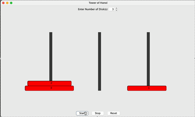

# TowerOfHanoi
This Java Swing project simulates the Tower of Hanoi puzzle, where the objective is to move a tower of disks from one rod to another, obeying certain constraints. The user can input the number of disks and press "Start" to initiate the simulation. The program will automatically move the disks following the Tower of Hanoi rules until they are correctly arranged on the target rod.

  
